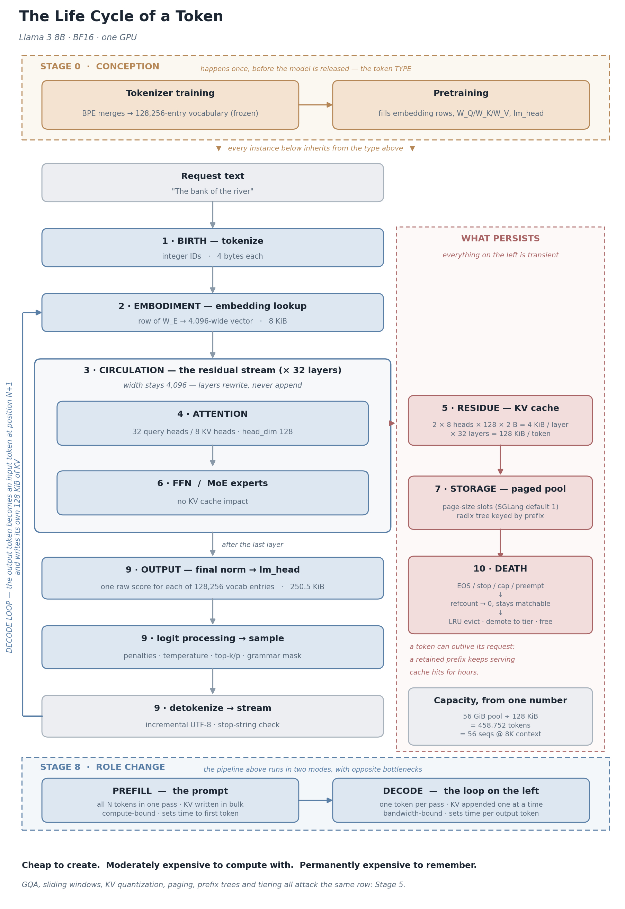

# The Life Cycle of a Token

*From characters in an HTTP request body to bytes returned to a GPU page pool.*

**Mandar Sawant** — Principal Engineer, Memory Solutions Lab, Samsung Semiconductor · [Data Fabric Solutions](https://semiconductor.samsung.com/about-us/locations/us-rnd-labs/memory-labs) · [Cognos](https://github.com/SamsungDS/Cognos)  
Distributed Systems · AI Memory Solutions, KV-cache memory tiering, storage profiling  
mandarsawant83@gmail.com · [LinkedIn](https://www.linkedin.com/in/mandar-sawant-0a37659) · [GitHub](https://github.com/mssawant)


---

Most explanations of "how an LLM works" stop three stages in. They tell you text becomes tokens, tokens become vectors, and attention relates vectors to each other. Then they stop — right before the part that actually determines what an inference deployment costs.

A token is not one thing. Over its life it takes at least seven distinct physical forms, each owned by a different part of the stack, each with a different byte cost and a different failure mode. This article walks the whole path: conception, birth, embodiment, circulation, residue, output, and death.

One distinction has to come first, because the word "token" is used for two different objects on two different timescales:

| | Conceived | Born | Dies |
|---|---|---|---|
| **Token type** — a vocabulary entry and its embedding row | Tokenizer training, then pretraining | At model release | When the checkpoint is deleted |
| **Token instance** — position N in one specific request | — | Tokenization at request time | Eviction from the KV pool |

Stages 1 through 10 below track an *instance*. Stage 0 is about the *type* — the genome every instance inherits.

The worked example throughout is **Llama 3 8B** (uniform architecture, easy to verify against `config.json`), with **Gemma 4 26B-A4B** used later as the case where the simple formula stops working. All numbers in this article are computed from published architecture parameters; the arithmetic is shown so you can re-derive it.

Terms are defined as they come up. If you would rather have them all in one place, there is a **glossary of every term used** at the end.

---

## The stages at a glance

| # | Stage | What the token physically *is* | Owned by | Bytes (Llama 3 8B, BF16) |
|---|---|---|---|---|
| 0 | Conception | A vocabulary entry and a trained embedding row | Model checkpoint | 8,192, shared by every instance |
| 1 | Birth | An integer ID | Tokenizer process | 4 |
| 2 | Embodiment | A row of the embedding matrix | Model weights | 8,192 (8 KiB) |
| 3 | Circulation | A position in the residual stream | Activation workspace | 8,192, transient |
| 4 | Residue | K and V vectors, every layer | KV cache pool | **131,072 (128 KiB)** |
| 5 | Storage | Slots inside paged blocks | Allocator + radix tree | 128 KiB × page occupancy |
| 6 | Output | A logits vector over the vocabulary | Sampling workspace | 256,512 (250.5 KiB), last position only |
| 7 | Death | Free slots in the page pool | Allocator | 0 |

Two of those rows are worth staring at before we start.

The **residue** row is the only one that persists. Everything else is transient. It is also the row that scales with conversation length, which is why it, and not the model weights, sets your concurrency ceiling.

The **output** row is larger than the residue row. A single token's logits vector (250.5 KiB) is roughly twice the size of its entire 32-layer KV footprint (128 KiB). This is why serving engines compute logits only at the positions that need them, and it is a good early hint that "cost per token" is not one number.

---

---

## The life cycle, end to end



---

## Stage 0 — Conception: the vocabulary is decided before the model exists

Every token instance inherits from a type, and that type is created in two separate events, months apart, by two processes that never meet.

### 0.1 Tokenizer training — the model is not present for this

The BPE merge table is learned first, on a sample of text, by a pure statistics job: start from bytes, repeatedly merge the most frequent adjacent pair, stop at the target vocabulary size. No neural network is involved and no gradients are computed.

When that job finishes, the vocabulary is **frozen for the lifetime of the model**. Nothing in pretraining, fine-tuning, RLHF, or continued training adds an entry, removes one, or changes how a string is segmented.

| Model | Vocabulary size |
|---|---|
| Llama 3 / 3.1 | 128,256 |
| Gemma 4 | 262,144 |

That single number then propagates through the whole architecture: it is the row count of the embedding matrix, the column count of the output projection, and — as Stage 9 shows — the width of every logits vector the model will ever produce.

It also fixes the segmentation the model is stuck with. If the tokenizer's corpus sample under-represented a language, a code style, or a numeric format, every instance of that content will be shredded into more tokens than necessary, forever. The cost is paid at inference time, by the deployment, at 128 KiB of KV cache per extra token.

### 0.2 Pretraining — the slot acquires meaning

At initialization the embedding matrix is random. Row 6201 is noise; it means nothing.

Pretraining fills it in. Every prediction error sends gradients back through the network, and the optimizer nudges the embedding rows, the `W_Q`/`W_K`/`W_V` projections that will later read those rows, and the `lm_head` that will write them. Over trillions of tokens the geometry organises itself: rows for tokens that appear in similar contexts drift toward each other, and polysemous tokens settle into a compromise position between their sense clusters — exactly the ambiguous state that Stage 4's attention layers exist to resolve.

So: **the type is conceived by a compression algorithm and gestated by gradient descent.** The vocabulary decides which slots exist; pretraining decides what lives in them.

### 0.3 Conception can fail

The two processes use different data, and that gap is observable. A token that appeared often enough in the tokenizer's sample to earn a vocabulary slot, but almost never in the pretraining corpus, ends up with an embedding row that was barely updated from its random initialization.

These are the "glitch tokens" — the slot exists, but nothing was ever conceived in it. Forcing one through the model produces erratic behaviour, because every downstream layer is operating on noise that it has no learned response to.

The practical reading for anyone serving models: **the vocabulary is part of the architecture, not part of the request.** It is as fixed as the layer count, it is chosen by a process you cannot inspect from `config.json` alone, and it sets a floor on what every request will cost you.

---

## Stage 1 — Birth: a token is an integer

A token exists before the neural network sees anything. Tokenization is a pure preprocessing step: a byte-level BPE tokenizer segments the input bytes and emits integer IDs against a fixed vocabulary.

```
"The bank of the river"  →  [791, 6201, 315, 279, 15140]
```

Three properties matter downstream:

- **The vocabulary was frozen at Stage 0.** The tokenizer has no discretion at request time; it applies a merge table decided before the model was trained.
- **Tokens are not words.** A common word is one token; a rare word, a number, or a non-Latin script may be several. Cost forecasting in characters or words is systematically wrong by a model-dependent factor.
- **Tokenization is not free, but it is cheap and CPU-side.** It is a scheduling concern (it can bottleneck a high-QPS front end with short prompts), not a memory concern.

At this point the token costs 4 bytes and knows nothing about its context.

---

## Stage 2 — Embodiment: a row lookup

The integer ID is used as a row index into the embedding matrix `W_E`, a `[vocab_size × d_model]` array of trained weights. For Llama 3 8B that is `128,256 × 4,096`.

```
token 6201 → W_E[6201] → a 4,096-number vector
```

That vector is the token's *context-free* meaning: whatever "bank" means averaged over every use of "bank" in the training corpus. Polysemous tokens end up as a compromise vector sitting between their sense clusters, waiting for attention to pull them one way.

### A correction worth making early: position is not added here

Many explanations state:

> `Initial vector = word embedding + position vector`

That was true of the original 2017 Transformer and of GPT-2, which added a sinusoidal or learned absolute positional vector to the embedding. It is **not** how Llama, Gemma, Qwen, or Mistral work. These models use **RoPE (rotary position embeddings)**, which are applied *inside each attention layer*, as a rotation of the Q and K vectors — not as an addition to the residual stream.

This is not pedantry. It has a direct operational consequence:

> Because RoPE is applied to K before it is cached, **a cached K vector is bound to the absolute position it was computed at.** A prefix can only be reused from a cache if it appears at the same token offset. This is the mechanical reason prefix caching works for shared system prompts (always at position 0) and does not work for a shared paragraph that floats around in the middle of different prompts.

---

## Stage 3 — Circulation: the residual stream has a fixed width

The token now travels through the stack as a `d_model`-wide vector. For Llama 3 8B, 4,096 numbers, 8 KiB in BF16.

**The vector does not grow.** This is the single most common misconception about how context accumulates. Layer 1 does not append to it; layer 1 *rewrites* it. Each block adds its output back into the same 4,096 slots:

```
x = x + Attention(RMSNorm(x))
x = x + FFN(RMSNorm(x))
```

The residual connection guarantees the width never changes. What changes is the *content* — the numbers shift from encoding "generic dictionary sense of 'bank'" to encoding "the sloped edge of a river, subject of the current clause, expected to be followed by a prepositional phrase."

So information accumulates by **superposition**, not by concatenation. A token deep in a document holds a synthesis of everything in its receptive field, compressed into the same 4,096 slots as a token at position 0. This is why:

> **A token's memory footprint is fixed by architecture, not by how much it "knows."** Token 10,000 costs exactly what token 1 costs. Density changes; bytes do not.

---

## Stage 4 — Attention: what the token offers and what it takes

Inside an attention layer, the 4,096-wide vector is projected three ways.

| Projection | Produces | Intuition |
|---|---|---|
| `W_Q` | Query | What this token is looking for |
| `W_K` | Key | What this token advertises to others |
| `W_V` | Value | What this token hands over if selected |

A **head** is one independent `(Q, K, V)` pathway operating in a narrow subspace of width `head_dim`:

```
head_dim = d_model / num_attention_heads = 4,096 / 32 = 128
```

A second correction: in real implementations there is no separate `W_Q` object per head. There is one fused projection of shape `[d_model × (num_heads · head_dim)]`, and the result is *viewed* as heads by reshaping. "32 heads" is a tensor layout, not 32 allocations.

The attention computation itself:

```
Attention(Q, K, V) = softmax( Q·Kᵀ / √head_dim ) · V
```

The `√head_dim` divisor (√128 ≈ 11.31) keeps the logits in a range where softmax does not saturate.

### A concrete pass

Take `"The bank of the river"` and one head that has learned to resolve noun sense. Scaled scores for the query at `bank` against each key:

| Key | Scaled score | Softmax weight |
|---|---|---|
| The | 4.79 | 2.01% |
| bank | 6.66 | 13.02% |
| of | 4.09 | 1.00% |
| the | 4.79 | 2.01% |
| **river** | **8.50** | **81.97%** |

*(These are the actual softmax outputs of those scores. If you see a worked example where the percentages are not the exponentials of the stated scores normalised, the example was written backwards — a surprisingly common error in AI-generated explainers.)*

The new vector for `bank` is then the weighted sum of the Value vectors:

```
V_bank_new = 0.0201·V_The + 0.1302·V_bank + 0.0100·V_of + 0.0201·V_the + 0.8197·V_river
```

Because `river` carries 82% of the weight, its features dominate the update. The token leaves the layer disambiguated.

### Grouped-Query Attention: where the query count and the cache count diverge

Modern models decouple the number of **query** heads from the number of **key/value** heads. Llama 3 8B has 32 query heads but only 8 KV heads — four query heads share each KV head.

| Scheme | KV heads | Cache cost |
|---|---|---|
| MHA (multi-head) | = query heads | Highest |
| **GQA (grouped-query)** | A divisor of query heads (Llama 3 8B: 8) | Reduced by the group factor |
| MQA (multi-query) | 1 | Lowest |

This matters because **only the KV head count appears in the cache formula.** Query heads cost FLOPs; KV heads cost bytes. When sizing memory, read `num_key_value_heads` from `config.json` and ignore `num_attention_heads` entirely.

---

## Stage 5 — Residue: the KV cache, exactly

This is the stage that determines deployment economics.

To avoid recomputing the Keys and Values of every prior token at every generation step, the engine writes them to a cache. The cache is per-layer, because every layer computes a different K and V for the same token — layer 1's Key looks for surface syntax, layer 30's Key looks for discourse-level structure, and they are not interchangeable.

### The formula

For a uniform architecture:

```
KV bytes per token per layer = 2 × H_kv × D_head × B_element
KV bytes per token           = L × (2 × H_kv × D_head × B_element)
```

| Symbol | Meaning | `config.json` key |
|---|---|---|
| `2` | One tensor for K, one for V | — |
| `H_kv` | KV heads (after tensor-parallel sharding) | `num_key_value_heads` |
| `D_head` | Head dimension | `head_dim`, or `hidden_size / num_attention_heads` |
| `B_element` | Bytes per element | `--kv-cache-dtype` (BF16=2, FP8=1) |
| `L` | Layers on this GPU (after pipeline-parallel sharding) | `num_hidden_layers` |

### Llama 3 8B, worked

| Quantity | Value |
|---|---|
| Layers | 32 |
| KV heads | 8 |
| Head dimension | 128 |
| Element size (BF16) | 2 bytes |
| **Per token, per layer** | 2 × 8 × 128 × 2 = **4,096 bytes (4 KiB)** |
| **Per token, all layers** | 4,096 × 32 = **131,072 bytes (128 KiB)** |

One more correction while we are here: 131,072 bytes is **128 KiB**, not "131 KB." The figure "131 KB" circulating in explainers comes from dividing by 1,000. At scale the difference is 2.4% of your KV pool.

Consequences:

| Context length | KV cache for one sequence |
|---|---|
| 1,000 tokens | 125 MiB |
| 8,192 tokens | 1 GiB |
| 131,072 tokens (Llama 3.1 max) | 16 GiB |

A single max-context Llama 3.1 8B conversation needs a KV cache the size of the model weights.

### When the flat formula breaks: heterogeneous layers

The multiply-by-`L` shortcut assumes every layer is identical. Increasingly, they are not. Hybrid architectures interleave **sliding-window (local) layers** with **global (full-attention) layers**, and may give them different head dimensions and different KV head counts.

Gemma 4 26B-A4B is the clearest current example: 30 layers on a 6-layer repeating pattern, with the global layers using a larger head dimension and fewer KV heads than the sliding ones.

| Layer type | Count | KV heads | Head dim | Bytes/token/layer | Tokens cached |
|---|---|---|---|---|---|
| Sliding (local) | 25 | 8 | 256 | 8,192 | min(N, W) |
| Global | 5 | 2 | 512 | 4,096 | N |

*(Read the exact global-layer indices and window size from your own `config.json` — `sliding_window`, `sliding_window_pattern`, `global_head_dim`, `num_global_key_value_heads`. Published summaries disagree on whether the pattern places 4 or 5 global layers in a 30-layer stack, and it changes the answer by 20%.)*

The correct general form is a **sum over layers**, not a multiply:

```
Total KV bytes = Σ_layers  2 × T_layer × H_kv(layer) × D_head(layer) × B_element
```

where `T_layer` is `N` for global layers and `min(N, W)` for sliding layers.

This produces two distinct costs, and confusing them is a common sizing error:

| Regime | Per-token cost | Value |
|---|---|---|
| `N ≤ W` (inside the window) | All layers cache | 5×4,096 + 25×8,192 = **220 KiB/token** |
| `N > W` (beyond the window) | **Only global layers grow** | 5×4,096 = **20 KiB/token** |

The *marginal* cost of the 100,000th token is 11× cheaper than the marginal cost of the 100th. At 256K context the whole cache lands at **5.2 GiB** — where a flat-architecture model of similar depth would need 32 GiB.

That asymmetry is the entire reason hybrid attention exists, and it means any capacity model that uses a single "bytes per token" constant will badly mis-forecast long-context workloads.

### Precision as a lever

`B_element` is the one term you can change at deploy time without changing the model.

| KV dtype | Bytes/element | Llama 3 8B per token | Tokens in a 56 GiB pool |
|---|---|---|---|
| BF16 / FP16 | 2 | 128 KiB | 458,752 |
| FP8 (`e4m3`) | 1 | 64 KiB | 917,504 |

Note that `--quantization` (weights) and `--kv-cache-dtype` (cache) are separate knobs. Quantizing weights frees HBM *for* the pool; quantizing the cache changes the cost *per token inside* it. Only the second one changes the formula.

---

## Stage 6 — The other half of the layer: FFN and MoE

Every transformer layer has two halves. Attention relates tokens to each other; the feed-forward network processes each token independently and is where most factual knowledge lives.

In a **Mixture-of-Experts** model, the single FFN is replaced by many expert FFNs plus a router that activates a small subset per token. Gemma 4 26B-A4B, for instance, routes across 128 experts with top-k 8.

The point that matters for this article:

> **MoE does not change KV bytes per token.** Experts live in the FFN half; the KV cache is written in the attention half. `--ep-size` shards experts across GPUs and dramatically cuts the *weight* footprint, but leaves the per-token cache dimensions untouched.

Attention heads and MoE experts are frequently conflated. They are not related:

| | Attention heads | MoE experts |
|---|---|---|
| Location | Attention half of the layer | FFN half of the layer |
| Activation | All heads run on every token | Router picks top-k of N |
| Job | Relate tokens to each other | Apply stored knowledge |
| KV cache impact | Direct (`H_kv`) | None |

What MoE changes is *density*: the same 4,096 slots leave the layer carrying output from a specialist subnetwork rather than a generalist one.

---

## Stage 7 — Storage: where the bytes actually sit

The KV cache is not a per-sequence contiguous buffer. That design wastes enormous memory to internal fragmentation, because you must reserve for the worst case. Modern engines page it.

### Page size

SGLang's `--page-size` sets how many tokens occupy one physical block:

```
Physical page bytes = KV bytes per token × page-size
                    = 131,072 × 16 = 2,097,152 bytes (2 MiB)
```

**The default is 1, not 16.** This trips people up because vLLM's equivalent (`--block-size`) defaults to 16. A page size of 1 means token-granular allocation: zero internal fragmentation and maximally precise prefix matching, at the cost of a larger page table and weaker kernel coalescing.

The trade space:

| Page size | Internal fragmentation | Prefix-cache hit granularity | Kernel efficiency | Backend support |
|---|---|---|---|---|
| 1 (SGLang default) | None | Per token | Lowest | Universal |
| 16–32 | Up to 15–31 wasted slots/seq | Per block | Good | Most backends |
| 64 | Up to 63 wasted slots/seq | Coarse | Best | Restricted |

Some attention backends require page sizes that are powers of two, and some paged kernels require page size > 1 to be usable at all. Verify against your chosen `--attention-backend` rather than assuming.

### RadixAttention and the prefix tree

SGLang stores cached prefixes in a radix tree keyed by token sequence. A new request walks the tree, finds the longest matching prefix, and inherits those pages instead of recomputing them. For workloads with a large shared system prompt or heavy few-shot prefixes, this is often the single largest throughput win available.

Two constraints follow directly from earlier sections:

1. **Matching happens at page granularity.** With `--page-size 64`, a 60-token match against a cached 64-token block yields nothing. Smaller pages raise the hit rate.
2. **Matching is position-bound.** Because the cached K is post-RoPE, a prefix only reuses if it sits at the same offset. Shared *prefixes* reuse; shared *middles* do not.

### The pool boundary

`--mem-fraction-static` divides HBM between static allocation (weights + KV pool) and the dynamic workspace (activations, scratch, communication buffers). Set it too high and you OOM during a prefill spike; too low and you strand capacity.

```
KV pool bytes ≈ (Total HBM × mem-fraction-static) − weight footprint
```

Which finally lets us state the concurrency equation:

```
Max concurrent sequences ≈ KV pool bytes / (KV bytes per token × average sequence length)
```

Worked, for Llama 3 8B BF16 on one 80 GiB GPU at `--mem-fraction-static 0.9`:

| Term | Value |
|---|---|
| Static budget | 72 GiB |
| Weights (8B × 2 bytes) | 16 GiB |
| KV pool | 56 GiB |
| Per token | 128 KiB |
| **Total cached tokens** | **458,752** |
| At 8K average context | **56 concurrent sequences** |
| Same, with FP8 KV cache | **112 concurrent sequences** |

Sharding changes the terms, not the structure:

| Lever | Effect on KV bytes per token |
|---|---|
| `--tp-size` | Divides `H_kv` per GPU |
| `--pp-size` | Divides `L` per GPU — unevenly, if the stack is heterogeneous |
| `--ep-size` | None |
| `--kv-cache-dtype` | Divides `B_element` |
| `--mem-fraction-static` | None — changes pool size, not token cost |

The pipeline-parallel caveat is worth underlining for hybrid models: if a PP boundary lands badly, one rank may hold four expensive global layers while another holds none, and your per-GPU memory is set by the unlucky rank.

---

## Stage 8 — Role change: prefill vs decode

The same token plays two completely different roles depending on phase, and conflating them produces bad mental models of cost.

| | Prefill | Decode |
|---|---|---|
| Tokens processed per pass | Whole prompt (or a chunk) | One |
| Bottleneck | Compute (GEMM-bound) | Memory bandwidth (cache read) |
| KV cache | Written in bulk | One token appended per step |
| Cost scaling | O(N²) attention, O(N) cache writes | O(N) cache reads per step |
| Latency metric | Time to first token | Time per output token |

A widely repeated claim is that "the KV cache grows word by word as the model reads your prompt." It does not. During prefill the entire prompt's K and V are computed in parallel and written in one or a few chunked passes — that is precisely what `--chunked-prefill-size` controls. Only during decode does the cache grow one token at a time.

This is also why prefill/decode disaggregation (`--disaggregation-mode`) exists: the two phases want different hardware profiles, and colocating them means one starves the other.

---

## Stage 9 — Output: how a token is born from the stream

Here is the stage almost every explainer omits. After the final layer, the token at the last position still has a 4,096-wide vector. Turning that into readable text takes five steps.

### 9.1 Final normalisation

A last RMSNorm is applied. Nothing about the token's identity has been decided yet.

### 9.2 Turning the vector into scores

The token's final 4,096-wide vector has to become a choice of word. One matrix multiply does that.

`lm_head` is a matrix with one column for every entry in the vocabulary — `4,096 × 128,256` for Llama 3 8B. Multiplying the vector by it gives back one number per entry:

```
4,096 numbers  ×  lm_head  →  128,256 numbers
```

Those numbers are the **logits**: a raw score for each possible next token. Higher means the model prefers it. They are not probabilities yet — nothing has been normalised and nothing sums to 1.

So the model does not "pick a word." It scores the entire vocabulary, every single time, and the picking happens in the next two steps.

That has a cost:

| Quantity | Value |
|---|---|
| Logits vector, FP16 | 128,256 × 2 = 256,512 bytes (**250.5 KiB**) |
| Same token's full KV footprint | 131,072 bytes (128 KiB) |

Scoring one position costs nearly **twice** the memory of that token's entire 32-layer KV residue. That is why engines only compute logits where a score is actually needed. During prefill, only the last position gets one — the other N−1 tokens skip `lm_head` entirely, because nobody is going to sample from them.

It is also why `--enable-fp32-lm-head` is a real memory decision, not a cosmetic one: it doubles the width of the largest transient vector in the pipeline.

One last detail: in some models `lm_head` is the embedding table reused, transposed. The same rows that turned token IDs into vectors on the way in are used to score tokens on the way out. Llama 3 8B keeps them separate; Gemma ties them, which is how it affords a 262,144-entry vocabulary.

### 9.3 Logit processing

Between raw logits and a sampled token sits a pipeline of transforms, each of which is a serving parameter:

| Transform | Effect |
|---|---|
| Logit bias | Additive per-token adjustment |
| Repetition / frequency / presence penalty | Down-weights tokens already present |
| Temperature | Divides logits — `T→0` approaches greedy, `T>1` flattens |
| Top-k | Keeps the k highest, masks the rest |
| Top-p (nucleus) | Keeps the smallest set whose mass exceeds p |
| Min-p | Keeps tokens above a fraction of the max probability |
| Grammar / JSON-schema mask | Sets illegal tokens to −∞ |

The last one is structurally interesting: constrained decoding works by masking logits, so a schema-constrained model is not "trying harder to produce valid JSON" — invalid tokens are made unreachable before sampling.

### 9.4 Sampling

Softmax over the surviving logits, then draw. Greedy decoding (`temperature=0`) skips the draw and takes the argmax. The output of this step is a single integer — the same kind of object we started with in Stage 1.

### 9.5 Detokenization

The ID is appended to the sequence and converted back to text. This is not a simple lookup:

- **Byte-level BPE tokens can be partial UTF-8 sequences.** A single token may be half of an emoji or one byte of a CJK character. A naive per-token decode emits replacement characters.
- Streaming therefore requires an **incremental detokenizer** that buffers until the byte sequence is complete.
- **Stop strings** must be checked against the decoded text, not the token IDs, because a stop sequence can straddle a token boundary. Engines typically hold back a small suffix to avoid emitting text that turns out to be part of a stop string.

`--stream-interval` controls how often decoded text is flushed to the client.

### 9.6 The loop closes

The newly sampled token is now an *input* token at position N+1. It goes back to Stage 2 — embedding lookup, residual stream, attention — and writes its own 128 KiB of K and V.

> **This is the defining property of autoregressive inference: every output token becomes an input token, and every input token permanently increases the read cost of every subsequent step.** Output tokens are not cheaper than input tokens in memory terms. They are more expensive, because generating them requires a full forward pass *and* leaves the same residue.

---

## Stage 10 — Death: how a token is freed

A sequence stops for one of five reasons:

| Termination | Trigger |
|---|---|
| EOS token | Model sampled the end-of-sequence ID |
| Stop string | Decoded text matched a client-supplied stop sequence |
| Length cap | `max_new_tokens` or `--max-model-len` reached |
| Client abort | Connection closed |
| Preemption | Scheduler evicted the request under memory pressure |

But termination is not death. What happens to the pages depends on the caching configuration, and there are three distinct endings.

### Ending A — Immediate free (radix cache disabled)

With `--disable-radix-cache`, the sequence's pages are returned to the allocator's free list the moment the request completes. The next request overwrites them. Simple, predictable, and it throws away every reuse opportunity.

### Ending B — Retention as a cache entry (the default)

With RadixAttention on, completion does **not** free the pages. The sequence's node in the radix tree has its reference count dropped to zero, which makes it an *eviction candidate* rather than garbage. The bytes stay resident and stay matchable.

So a token can outlive its request. A system-prompt token written at 09:00 may still be serving cache hits at 17:00, having been read by thousands of requests it was never part of.

Actual death comes when the pool runs low and the eviction policy reclaims the node — `--radix-eviction-policy` selects LRU or LFU. Only then is the page returned to the free list.

This produces a useful mental correction:

> The KV pool is not "memory in use." It is closer to a page cache: mostly full by design, with occupancy split between live sequences (pinned, refcount > 0) and retained prefixes (reclaimable). A pool at 95% is not necessarily under pressure. The number to watch is the live fraction and the eviction rate, not total occupancy.

### Ending C — Demotion to a slower tier

Hierarchical KV caching adds a step before eviction: rather than discarding a cold-but-valuable prefix, the engine moves it out of HBM to host DRAM, to a CXL-attached tier, or to NVMe, and keeps it matchable. A hit against a demoted prefix costs a transfer instead of a recomputation, which is a win whenever transfer bandwidth beats prefill FLOPs for that prefix length.

That crossover is the whole design question for tiered KV storage:

```
reuse if:  prefix_tokens × KV_bytes_per_token / transfer_bandwidth  <  prefill_time(prefix_tokens)
```

Both sides of that inequality are computed from the per-token constant derived in Stage 5. The number that decides the cheapest sizing of your GPU fleet is the same number that decides whether a token is worth keeping alive on a slower tier.

### Preemption: death before completion

Under memory pressure the scheduler may evict a *running* request, freeing its pages and returning it to the queue. When it resumes, its prompt is re-prefilled from scratch — or, if the prefix survived in the radix tree, partially restored from cache. Preemption converts a memory shortage into wasted compute, which is why rising eviction rates show up as latency variance long before they show up as OOMs.

---

## The tokenomics ledger

Putting the whole life cycle on one line, for Llama 3 8B, BF16, single GPU:

| Stage | Form | Persistent bytes | Dominant cost |
|---|---|---|---|
| 1. Tokenize | int ID | 4 | CPU, negligible |
| 2. Embed | 4,096-vector | 0 (read from weights) | Memory read |
| 3. Circulate | 4,096-vector | 0 (transient) | GEMM FLOPs |
| 4. Attend | Q/K/V, 128 per head | 0 | O(N) reads per step |
| 5. Cache | 64 K/V rows × 1,024 | **131,072** | **HBM capacity** |
| 6. FFN / MoE | 4,096-vector | 0 | GEMM FLOPs (sparse under MoE) |
| 7. Page | Slot in a 2 MiB page (at page-size 16) | 131,072 + fragmentation | Allocator pressure |
| 8. Emit | 128,256 logits | 0 (transient) | 250.5 KiB workspace |
| 9. Feed back | int ID at position N+1 | +131,072 | Repeat |
| 10. Retire | Reclaimable tree node | 131,072 until evicted | Eviction policy |

The asymmetry that falls out of this table is the practical takeaway. A token is cheap to create, moderately expensive to compute with, and **permanently expensive to remember**. Every architectural trick in modern serving — GQA, sliding windows, KV quantization, paging, prefix trees, tiering — attacks row 5.

---

## Errata: claims to stop repeating

These all appear in widely circulated explainers, including AI-generated ones. Each is corrected above.

| Common claim | Reality |
|---|---|
| "Position is added to the embedding vector" | True for GPT-2-era absolute PE; Llama/Gemma/Qwen use RoPE applied to Q and K inside each attention layer |
| "131 KB per token" | 131,072 bytes is 128 KiB; the 131 figure comes from dividing by 1,000 |
| "The KV cache grows word by word as the model reads the prompt" | Prefill writes the prompt's KV in bulk; only decode appends one token at a time |
| "SGLang's `--page-size` defaults to 16" | SGLang defaults to 1; vLLM's `--block-size` defaults to 16 |
| "Each head has its own `W_Q` matrix" | One fused projection, reshaped into heads |
| "Multiply per-layer cost by layer count" | Only valid for uniform stacks; hybrid models need a per-layer sum |
| "MQA means all heads share one cache" | That is MQA specifically (`H_kv = 1`); GQA uses groups, e.g. 8 KV heads for 32 query heads |
| "MoE experts are the attention heads" | Different half of the layer, different job, zero KV impact |
| "Later tokens cost more memory because they know more" | Fixed per-token cost; information is superposed, not appended |
| "The model learns its vocabulary during training" | The merge table is learned by a separate statistics job *before* pretraining and is frozen from then on; pretraining only fills in the embedding rows |


## How to apply this to your own model

Everything above reduces to five values you can read directly out of `config.json`, plus two launch flags:

| Value | Where | Used for |
|---|---|---|
| `num_hidden_layers` | config.json | `L` |
| `num_key_value_heads` | config.json | `H_kv` |
| `head_dim` (or `hidden_size / num_attention_heads`) | config.json | `D_head` |
| `sliding_window`, `sliding_window_pattern` | config.json | Per-layer `T` |
| `global_head_dim`, `num_global_key_value_heads` | config.json (hybrid models only) | Global-layer terms |
| `--kv-cache-dtype` | launch | `B_element` |
| `--tp-size`, `--pp-size` | launch | Per-GPU `H_kv` and `L` |

Then:

```
KV bytes/token = Σ_layers 2 × H_kv(layer)/tp × D_head(layer) × B_element
concurrency    ≈ [(HBM × mem-fraction-static) − weights] / (KV bytes/token × avg_seq_len)
```

Two numbers, derived from seven inputs. Everything else in a serving config is a way of moving one of them.

---

## Glossary

Terms are defined in place as the article introduces them; this is the lookup version, grouped by where in the life cycle they belong.

### Tokens and text

| Term | Definition |
|---|---|
| **Token** | The unit a model reads and writes. Not a word — a fragment of bytes chosen by the tokenizer. A common word is usually one token; a rare word, a number, or non-Latin script may be several. |
| **Token type** | A vocabulary entry and its embedding row. Created once, at Stage 0, and shared by every request the model ever serves. |
| **Token instance** | One occurrence of a type at a specific position in a specific request. This is what the article's Stages 1–10 follow. |
| **BPE (byte-pair encoding)** | The algorithm that builds the vocabulary: start from raw bytes, repeatedly merge the most frequent adjacent pair, stop at the target size. Run once, before pretraining. |
| **Merge table** | The frozen output of BPE training. It, not the model, decides how a string is split. |
| **Vocabulary size** | The number of distinct tokens the model recognises. 128,256 for Llama 3; 262,144 for Gemma 4. Sets the height of the embedding matrix and the width of every logits vector. |
| **Tokenization** | Text → integer IDs, at request time. CPU-side preprocessing; the network is not involved. |
| **Detokenization** | Integer IDs → text, on the way out. Needs to be incremental, because one token can be a partial UTF-8 sequence. |
| **Glitch token** | A vocabulary entry that earned a slot during tokenizer training but barely appeared during pretraining, leaving its embedding row close to its random initialization. Produces erratic output when forced through the model. |

### Model architecture

| Term | Definition |
|---|---|
| **Embedding matrix (`W_E`)** | A `[vocab_size × d_model]` table of trained weights. A token ID is a row index into it. |
| **`d_model` / hidden size** | The width of the vector a token is represented by between layers. 4,096 for Llama 3 8B. |
| **Residual stream** | The `d_model`-wide vector as it travels through the stack. Each block adds its output back into it, so the width never changes — layers rewrite, they do not append. |
| **RMSNorm** | Root-mean-square normalization. Rescales a vector by its own magnitude before a block reads it, to keep activations in a stable range. |
| **Query, Key, Value (Q, K, V)** | Three projections of the same token vector. Q is what the token is looking for, K is what it advertises to others, V is what it hands over if selected. |
| **Attention head** | One independent Q/K/V pathway operating in a narrow subspace of width `head_dim`. In code it is a slice of a fused projection, not a separate object. |
| **`head_dim`** | The width of one head's subspace. Usually `d_model / num_attention_heads` — 128 for Llama 3 8B. |
| **Softmax** | Turns a list of raw scores into a distribution that sums to 1, by exponentiating each and dividing by the total. Used inside attention, and again at sampling. |
| **RoPE (rotary position embedding)** | How modern models encode position: Q and K are rotated by a position-dependent angle *inside* each attention layer. Replaces the older approach of adding a position vector to the embedding. |
| **MHA / GQA / MQA** | Multi-head attention gives every query head its own KV head. Grouped-query attention shares one KV head across a group of query heads (Llama 3 8B: 32 query, 8 KV). Multi-query attention uses a single KV head. Only the KV head count affects cache size. |
| **Sliding-window (local) layer** | An attention layer restricted to the most recent `W` tokens. Caps that layer's cache at `W` entries regardless of sequence length. |
| **Global layer** | A full-attention layer that can see the whole sequence. Its cache grows with every token, which makes it the marginal cost in a hybrid model. |
| **FFN (feed-forward network)** | The second half of each transformer layer. Processes each token independently; holds most of the model's stored knowledge. |
| **MoE (mixture of experts)** | An FFN split into many expert subnetworks, with a router activating a small subset per token. Cuts compute per token. Has no effect on KV cache size. |
| **Router** | The small network that scores experts and picks the top-k for a given token. |
| **Superposition** | Storing more distinct information in a vector than it has dimensions, by encoding it as directions rather than slots. Why a token deep in a document costs the same bytes as one at position 0. |

### Memory and serving

| Term | Definition |
|---|---|
| **KV cache** | The stored K and V vectors of every token processed so far, per layer, so they need not be recomputed at every generation step. The only part of a token that persists. |
| **`num_key_value_heads`** | The config field that sets `H_kv`. The single most important number for cache sizing; `num_attention_heads` is irrelevant to it. |
| **KV pool** | The block of GPU memory reserved to hold the KV cache. Its size divided by bytes-per-token sets the concurrency ceiling. |
| **Paged attention** | Allocating the KV cache in fixed-size blocks rather than one contiguous buffer per sequence, so memory is not reserved for a worst case that may never arrive. |
| **Page size / block size** | How many tokens fit in one block. SGLang's `--page-size` defaults to 1; vLLM's `--block-size` defaults to 16. Larger pages waste more on partial blocks and match prefixes more coarsely. |
| **Internal fragmentation** | The unused slots in a partially filled page. Memory that is allocated but doing nothing. |
| **Prefix caching** | Reusing the cached KV of a prompt prefix that has been seen before, instead of recomputing it. |
| **RadixAttention** | SGLang's implementation: cached prefixes are held in a radix tree keyed by token sequence, so a new request can inherit the longest match. |
| **Reference count** | How many live sequences are using a cache node. At zero the node is no longer pinned and becomes eligible for eviction — but it is still matchable, so it keeps serving hits. |
| **Eviction** | Reclaiming a cache node under memory pressure, by LRU or LFU policy. The actual death of a token's bytes. |
| **Preemption** | Evicting a *running* request to free memory, sending it back to the queue. Converts a memory shortage into repeated compute. |
| **Tiering** | Demoting a cold prefix out of GPU memory to host DRAM, CXL, or NVMe while keeping it matchable, so a later hit costs a transfer instead of a recomputation. |
| **`--mem-fraction-static`** | The share of GPU memory given to weights plus KV pool, with the rest left for activations and scratch. |
| **Quantization** | Storing numbers in fewer bits. `--quantization` applies to weights and frees room for the pool; `--kv-cache-dtype` applies to the cache and changes the cost per token. |
| **TP / PP / EP** | Tensor, pipeline, and expert parallelism. TP divides KV heads per GPU, PP divides layers per GPU, EP divides experts and does not touch the cache at all. |

### Output and sampling

| Term | Definition |
|---|---|
| **`lm_head` / output projection** | The `[d_model × vocab_size]` matrix that turns a token's final vector into one score per vocabulary entry. In some models it is the embedding matrix reused, transposed. |
| **Logit** | The raw, unnormalised score the model assigns to one vocabulary entry as a candidate next token. Any real number, positive or negative; higher means more preferred. Becomes a probability only after softmax. |
| **Logits vector** | The full set of them — one per vocabulary entry, so 128,256 numbers for Llama 3 8B. Produced only at positions where a token will actually be sampled. |
| **Logit processing** | The transforms applied between raw logits and sampling: logit bias, repetition/frequency/presence penalties, temperature, top-k, top-p, min-p, and grammar masks. |
| **Temperature** | Divides the logits before softmax. Below 1 sharpens the distribution toward the top candidate; above 1 flattens it. At 0 the model is effectively greedy. |
| **Top-k** | Keep the k highest-scoring tokens, discard the rest. |
| **Top-p (nucleus)** | Keep the smallest set of tokens whose probabilities sum to at least p. |
| **Min-p** | Keep tokens scoring above a fixed fraction of the top token's probability. Adapts to how confident the model is. |
| **Grammar / schema mask** | Sets the logits of structurally illegal tokens to negative infinity, making them unreachable. How constrained decoding guarantees valid JSON rather than merely encouraging it. |
| **Greedy decoding** | Take the highest-scoring token with no random draw. Equivalent to temperature 0. |
| **Sampling** | Drawing the next token from the processed distribution. Output is a single integer — the same kind of object tokenization produced at Stage 1. |
| **EOS token** | The vocabulary entry the model emits to signal it is finished. |
| **Stop string** | A client-supplied text sequence that ends generation. Checked against decoded text, not token IDs, because it can straddle a token boundary. |
| **Autoregressive** | Each output token is appended to the input and fed back in. Why generation is sequential, and why every token generated permanently raises the cost of the next one. |
| **Prefill** | The pass that processes the whole prompt at once. Compute-bound; sets time to first token. |
| **Decode** | The per-token generation loop. Memory-bandwidth-bound; sets time per output token. |
| **Chunked prefill** | Splitting a long prompt's prefill into pieces so it does not monopolise the GPU and stall decoding for other requests. |
| **TTFT / TPOT** | Time to first token and time per output token — the latency metrics for prefill and decode respectively. |

### Units and notation

| Term | Definition |
|---|---|
| **KiB / MiB / GiB** | Binary units: 1 KiB = 1,024 bytes. Used throughout, because memory allocators work in powers of two. |
| **KB / MB / GB** | Decimal units: 1 KB = 1,000 bytes. Mixing the two is the source of the widely quoted "131 KB per token," which is 128 KiB. |
| **BF16 / FP16** | 16-bit floating point, 2 bytes per number. The default for weights and KV cache. |
| **FP8** | 8-bit floating point, 1 byte per number. Halves KV cache cost per token. |
| **`H_kv`, `D_head`, `L`, `B_element`** | The four terms of the KV sizing formula: KV heads, head dimension, layer count, and bytes per element. |


## About the author

**Mandar Sawant** is a Principal Engineer in the Memory Solutions Lab at Samsung Semiconductor, working in the [Data Fabric Solutions](https://semiconductor.samsung.com/about-us/locations/us-rnd-labs/memory-labs) team on the [Cognos](https://github.com/SamsungDS/Cognos) platform. His work covers Distributed systems, AI Memory Solutions, KV-cache memory tiering across DRAM, CXL, and NVMe, and storage profiling for LLM serving stacks. He has a background in Linux systems programming and designing scalable distributed systems.
He can be reached at mandarsawant83@gmail.com, and his work is at [github.com/mssawant](https://github.com/mssawant).
